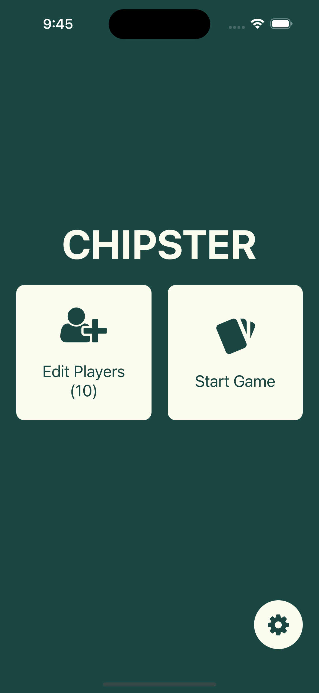
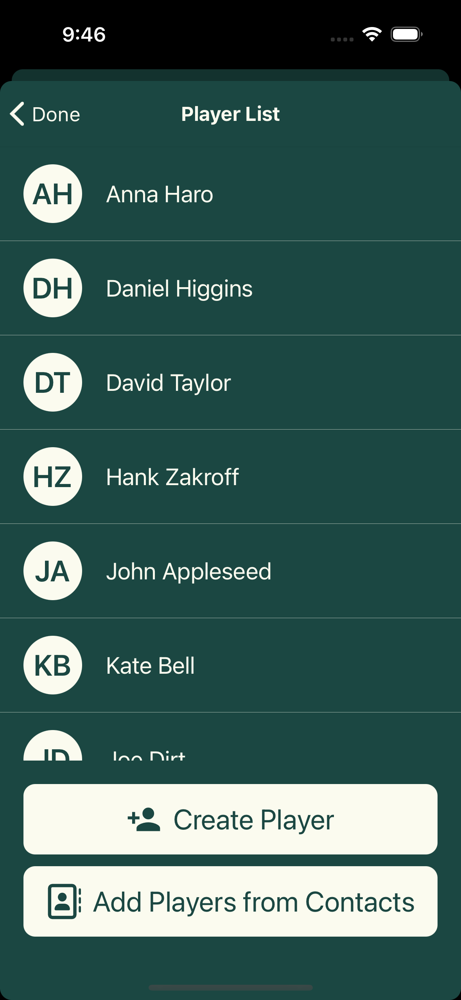
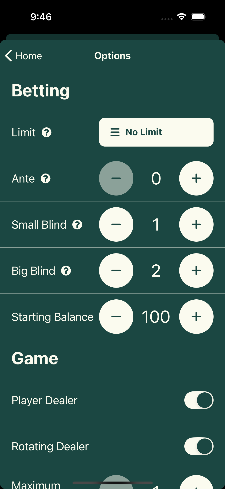
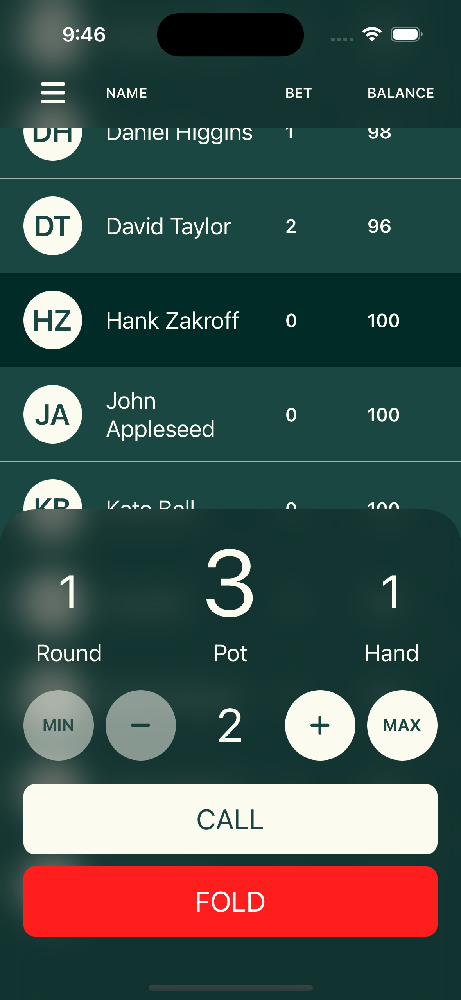
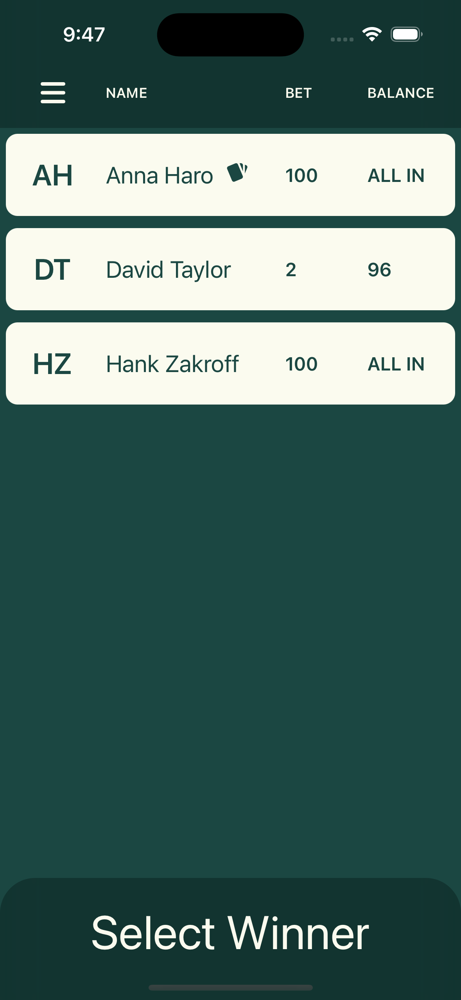
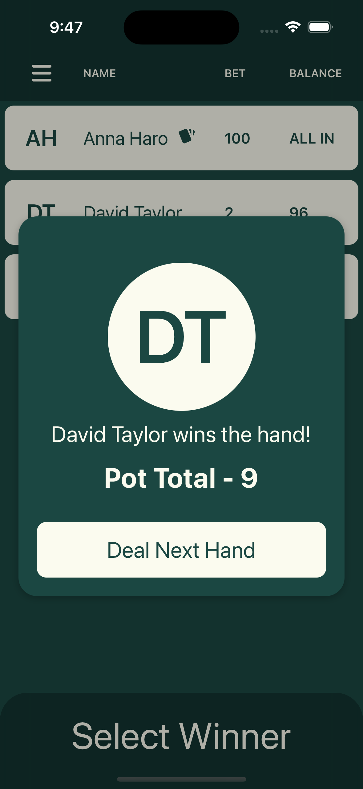

# Chipster 🃏

<p align="center">
  
</p>

<p align="center">
  <strong>The poker game management app that makes home games effortless</strong>
</p>

<p align="center">
  Tired of messy chip stacks, forgotten blinds, and complicated scorekeeping? Chipster transforms your poker nights with elegant game management, real-time chip tracking, and seamless player administration.
</p>

<p align="center">
  <em>A complete mobile solution built from the ground up for serious poker enthusiasts.</em>
</p>

---

## Features

### 🎯 Game Management
- **Full Poker Game Support**: Complete betting rounds with call/raise/fold actions
- **Chip Tracking**: Real-time balance tracking for all players
- **Dealer Rotation**: Automatic or manual dealer management
- **Blind Management**: Configurable small blind, big blind, and ante
- **Winner Selection**: Easy winner confirmation with pot distribution

### 👥 Player Management
- **Contact Integration**: Import players from device contacts
- **Custom Players**: Add players manually with photos
- **Player Statistics**: Track wins, losses, and performance
- **Drag & Drop Ordering**: Reorder players at the table
- **Editable Profiles**: Update player information on the fly

### ⚙️ Customizable Game Options
- **Betting Limits**: No-limit, pot-limit, and fixed-limit games
- **Blind Structure**: Fully customizable blind levels
- **Game Rules**: Flexible ante and betting configurations
- **Visual Themes**: Light and dark mode support

### 📊 Statistics & Tracking
- **Game History**: Track multiple game sessions
- **Player Stats**: Individual player performance metrics
- **Profit/Loss Tracking**: Monitor winnings and losses over time

## App Walkthrough

| Welcome | Add Players | Game Setup |
| :---: | :---: | :---: |
|  |  |  |

| Live Game | Winner Selection | Game Summary |
| :---: | :---: | :---: |
|  |  |  |

## What Makes Chipster Special

🚀 **Built for Real Poker Games** - Designed by poker players, for poker players. Every feature addresses actual pain points from home game management.

🎨 **Intuitive Design** - Clean, modern interface that anyone can pick up immediately. No learning curve, just start playing.

📱 **Cross-Platform** - Works seamlessly on iOS, Android, and web browsers. Your game data stays with you across all devices.

⚡ **Lightning Fast** - Optimized performance ensures smooth gameplay even with large player groups and extended sessions.

🔗 **Smart Integrations** - Import players directly from your contacts, add custom photos, and maintain player histories across games.

---

## Built With

React Native • Expo • Redux • Custom UI Components

*A showcase of modern mobile development techniques and user experience design*

---

<details>
<summary><strong>🛠️ For Developers - Setup Instructions</strong></summary>

### Prerequisites
- Node.js (v16 or later)
- Expo CLI (`npm install -g expo-cli`)

### Quick Start
```bash
git clone https://github.com/yourusername/chipster.git
cd chipster
npm install
npm start
```

### Platform Commands
```bash
npm run ios     # iOS Simulator
npm run android # Android Emulator  
npm run web     # Web Browser
```
</details>

# Run on specific platforms
npm run ios
npm run android
npm run web

# Run tests
npm test

# Lint code
npm run lint
```

## Project Structure

```
chipster/
├── app/                    # Expo Router pages
│   ├── _layout.jsx        # Root layout
│   ├── index.jsx          # Home screen
│   └── store.jsx          # Game screen
├── components/            # Reusable UI components
│   ├── Game/             # Game-specific components
│   ├── Players/          # Player management components
│   ├── Options/          # Settings components
│   └── navigation/       # Navigation components
├── features/slices/      # Redux state slices
├── hooks/               # Custom React hooks
├── constants/           # App constants (colors, etc.)
├── assets/             # Images, fonts, and other assets
├── ios/                # iOS-specific files
└── android/            # Android-specific files
```

## Key Components

### Game Components
- `Game.jsx` - Main game interface with betting controls
- `BettingControls.jsx` - Handle poker actions (call, raise, fold)
- `PlayerRow.jsx` - Individual player display with chips
- `Stats.jsx` - Game statistics and history
- `WinnerConfirmModal.jsx` - End-of-hand winner selection

### Player Management
- `Players.jsx` - Player list management
- `AddPlayerFormModal.jsx` - Add new players
- `AddContactFormModal.jsx` - Import from contacts
- `EditPlayerFormModal.jsx` - Edit existing players

## State Management

The app uses Redux Toolkit with the following slices:
- `playersSlice.jsx` - Player data and management
- `optionsSlice.jsx` - Game settings and configuration

## Permissions

The app requires the following permissions:
- **Contacts** (iOS/Android): Import players from device contacts
- **Photos** (iOS/Android): Add player profile pictures
- **Audio Recording** (Android): For potential future features

## Building for Production

### iOS
```bash
# Build for iOS App Store
expo build:ios
```

### Android
```bash
# Build for Google Play Store
expo build:android
```

## Contributing

1. Fork the repository
2. Create your feature branch (`git checkout -b feature/amazing-feature`)
3. Commit your changes (`git commit -m 'Add some amazing feature'`)
4. Push to the branch (`git push origin feature/amazing-feature`)
5. Open a Pull Request

## License

This project is licensed under a custom Educational and Attribution License - see the [LICENSE.md](LICENSE.md) file for details.

**Summary**: This software may be used for educational purposes and personal learning with proper attribution to the original author. Commercial use, redistribution, and public hosting require explicit permission.

## Acknowledgments

- Built with [Expo](https://expo.dev/)
- Icons by [FontAwesome](https://fontawesome.com/)
- UI inspiration from modern mobile design patterns

---

**Chipster** - Making poker nights easier, one hand at a time. 🎰